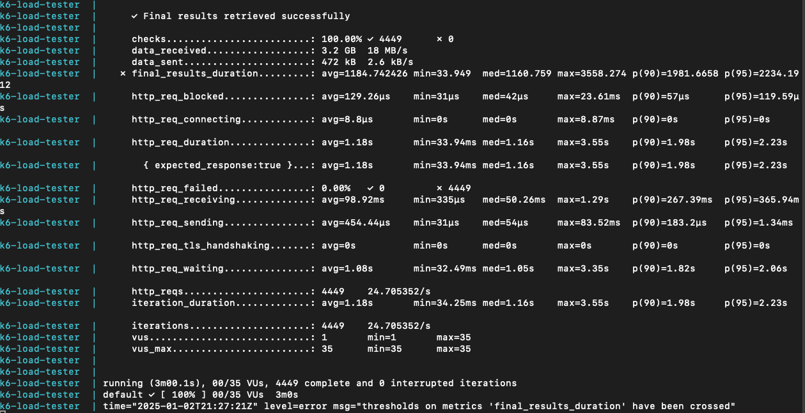

<div id="top"></div>

<div align="center" style="margin-bottom: 50px;">
  

  <h1>BBB Voting System </h1>

   <h4>
    <a href="https://github.com/Jav4Script/pulls">Request Feature</a>
    <span> . </span>
    <a href="https://github.com/Jav4Script/issues">Report Issue</a>
  </h4>
</div>


Um sistema altamente escalável e confiável para gerenciamento de votações em tempo real, inspirado em desafios do Big Brother Brasil.

<div align="right"><a style="font-weight: 500;" href="#top">Back to Top</a></div>


## Índice

- [Índice](#índice)
- [Pré-requisitos](#pré-requisitos)
- [Setup do Projeto](#setup-do-projeto)
- [Comandos Úteis](#comandos-úteis)
- [Arquitetura](#arquitetura)
  - [Estrutura de Pastas](#estrutura-de-pastas)
  - [Endpoints](#endpoints)
- [Dependências](#dependências)
- [Variáveis de Ambiente](#variáveis-de-ambiente)
- [Testes de Carga](#testes-de-carga)
  - [Endpoints Testados](#endpoints-testados)
    - [Gerar CAPTCHA](#gerar-captcha)
    - [Validar CAPTCHA](#validar-captcha)
    - [Criar Participante](#criar-participante)
    - [Votar](#votar)
    - [Obter Resultados Parciais](#obter-resultados-parciais)
    - [Obter Resultados Finais](#obter-resultados-finais)
  - [Ferramenta Utilizada](#ferramenta-utilizada)
  - [Importância dos Testes de Carga](#importância-dos-testes-de-carga)
  - [Resultados dos Testes de Carga](#resultados-dos-testes-de-carga)
    - [Participant](#participant)
    - [Captcha](#captcha)
    - [Vote](#vote)
    - [Results](#results)
    - [All Endpoints](#all-endpoints)

<div align="right"><a style="font-weight: 500;" href="#top">Back to Top</a></div>


## Pré-requisitos 
- [Docker](https://docs.docker.com/get-docker/)
- [Docker Compose](https://docs.docker.com/compose/)
- [Make](https://www.gnu.org/software/make/)

<div align="right"><a style="font-weight: 500;" href="#top">Back to Top</a></div>


## Setup do Projeto 
1. Clone este repositório:
    ```bash
    git clone https://github.com/Jav4Script/bbb-voting-system.git
    cd bbb-voting-system
    ```

2. Copie o arquivo `.env.example` para `.env`:
    ```bash
    cp .env.example .env
    ```

3. Gere a documentação Swagger e as dependências Wire:
    ```bash
    make swag
    make wire
    ```

4. Compile a aplicação para desenvolvimento:
    ```bash
    make build-dev
    ```

5. Execute a aplicação para desenvolvimento:
    ```bash
    make run-dev
    ```

<div align="right"><a style="font-weight: 500;" href="#top">Back to Top</a></div>


## Comandos Úteis 

| Comando                    | Descrição                                      |
|----------------------------|------------------------------------------------|
| `make swag`                | Gera a documentação Swagger                    |
| `make wire`                | Gera as dependências Wire                      |
| `make build-dev`           | Compila o projeto para desenvolvimento         |
| `make build-prod`          | Compila o projeto para produção                |
| `make run-dev`             | Executa a aplicação para desenvolvimento       |
| `make run-prod`            | Executa a aplicação para produção              |
| `make load-test`           | Executa todos os testes de carga               |
| `make load-test-participant`| Executa os testes de carga relacionados a participantes |
| `make load-test-captcha`   | Executa os testes de carga relacionados a CAPTCHA |
| `make load-test-vote`      | Executa os testes de carga relacionados a votos |
| `make load-test-results`   | Executa os testes de carga relacionados a resultados |
| `make stop`                | Para todos os containers em execução           |
| `make clean`               | Remove arquivos temporários e diretórios de documentação |
| `make clear-redis`         | Limpa todos os dados do Redis                  |
| `make clear-test-resources`| Limpa os recursos de teste (Database, Redis, RabbitMQ) |

<div align="right"><a style="font-weight: 500;" href="#top">Back to Top</a></div>


## Arquitetura 

Este sistema foi projetado com os seguintes componentes:

- API REST para gerenciamento de votos.
- Redis para armazenamento temporário de resultados.
- RabbitMQ para gerenciamento de picos de tráfego.
- PostgreSQL para persistência de dados históricos.


### Estrutura de Pastas

```plaintext
.
├── .air.toml                   # Configuração do Air para hot reload
├── .env                        # Arquivo de configuração de variáveis de ambiente
├── .env.example                # Exemplo de arquivo de configuração de variáveis de ambiente
├── .gitignore                  # Arquivo para especificar quais arquivos/diretórios o Git deve ignorar
├── .vscode/                    # Configurações do Visual Studio Code
├── cmd/
│   └── main.go                 # Arquivo principal da aplicação
├── docker-compose.yml          # Arquivo de configuração do Docker Compose
├── Dockerfile                  # Arquivo de configuração do Docker
├── docs/
│   ├── assets/                 # Recursos estáticos para documentação
│   ├── docs.go                 # Documentação gerada pelo Swag
│   ├── swagger.json            # Arquivo JSON da documentação Swagger
│   └── swagger.yaml            # Arquivo YAML da documentação Swagger
├── go.mod                      # Arquivo de dependências do Go
├── go.sum                      # Hashes das dependências do Go
├── HISTORY.md                  # Histórico do projeto
├── internal/
│   ├── application/
│   │   └── usecases/           # Casos de uso da aplicação
│   │       ├── cast_vote_usecase.go          # Caso de uso para registrar um voto
│   │       ├── create_participant_usecase.go # Caso de uso para criar um participante
│   │       ├── get_final_results_usecase.go  # Caso de uso para obter resultados finais
│   │       ├── sync_cache_usecase.go         # Caso de uso para sincronizar o cache
│   │       └── ...                            # Outros casos de uso
│   ├── domain/
│   │   ├── constants.go        # Constantes do domínio
│   │   ├── dtos/               # Data Transfer Objects
│   │   ├── entities/           # Entidades do domínio
│   │   │   ├── participant.go  # Entidade de participante
│   │   │   └── vote.go         # Entidade de voto
│   │   ├── errors/             # Definições de erros do domínio
│   │   ├── producer/           # Interface de produtor de mensagens
│   │   ├── repositories/       # Interfaces de repositórios
│   │   └── services/           # Interfaces de serviços
│   ├── infrastructure/
│   │   ├── config/             # Configurações da infraestrutura
│   │   │   ├── database.go     # Configuração do banco de dados
│   │   │   ├── environment.go  # Carregamento de variáveis de ambiente
│   │   │   ├── rabbitmq.go     # Configuração do RabbitMQ
│   │   │   ├── redis.go        # Configuração do Redis
│   │   │   └── wire.go         # Configuração do Wire para injeção de dependências
│   │   ├── consumer/           # Consumidores de mensagens
│   │   │   └── rabbitmq_consumer.go          # Consumidor de mensagens do RabbitMQ
│   │   ├── controllers/        # Controladores da aplicação
│   │   │   ├── participant_controller.go     # Controlador de participantes
│   │   │   ├── vote_controller.go            # Controlador de votos
│   │   │   └── ...                            # Outros controladores
│   │   ├── jobs/               # Jobs da aplicação
│   │   │   └── sync_cache_job.go             # Job para sincronizar o cache
│   │   ├── mappers/            # Mapeadores de entidades
│   │   │   ├── participant_result_mapper.go  # Mapeador de resultados de participantes
│   │   │   ├── final_results_mapper.go       # Mapeador de resultados finais
│   │   │   └── vote_mapper.go                # Mapeador de votos
│   │   ├── middlewares/        # Middlewares da aplicação
│   │   ├── models/             # Modelos da aplicação
│   │   │   ├── participant_model.go          # Modelo de participante
│   │   │   ├── vote_model.go                 # Modelo de voto
│   │   │   └── ...                            # Outros modelos
│   │   ├── producer/           # Implementação do produtor de mensagens
│   │   │   └── rabbitmq_producer.go          # Implementação do RabbitMQ
│   │   ├── repositories/       # Implementações dos repositórios
│   │   │   ├── postgres/
│   │   │   │   ├── participant_repository.go # Implementação do repositório de participantes no PostgreSQL
│   │   │   │   └── vote_repository.go        # Implementação do repositório de votos no PostgreSQL
│   │   │   └── redis/
│   │   │       └── redis_repository.go       # Implementação do repositório no Redis
│   │   ├── routes.go           # Definição das rotas da aplicação
│   │   ├── server.go           # Inicialização do servidor
│   │   └── services/           # Serviços da aplicação
│   │       └── captcha_service.go            # Serviço de CAPTCHA
├── main                        # Arquivo principal da aplicação
├── makefile                    # Arquivo de automação de tarefas
├── README.md                   # Documentação do projeto
└── scripts/
    └── rabbitmq-init.sh           # Script de inicialização da fila
├── tmp/
│   ├── build-errors.log        # Log de erros de build
│   └── main                    # Binário principal gerado pelo build
```

<div align="right"><a style="font-weight: 500;" href="#top">Back to Top</a></div>


### Endpoints


<div align="right"><a style="font-weight: 500;" href="#top">Back to Top</a></div>


## Dependências

- [](https://github.com/gin-gonic/gin)
- [](https://github.com/go-redis/redis)
- [](https://github.com/streadway/amqp)
- [](https://github.com/lib/pq)
- [](https://github.com/swaggo/swag)
- [](https://github.com/google/wire)
- [](https://github.com/joho/godotenv)
- [](https://gorm.io/gorm)
- [](https://github.com/gin-contrib/cors)
- [](https://github.com/robfig/cron)
- [](https://github.com/google/uuid)
- [](https://github.com/dchest/captcha)
- [](https://github.com/swaggo/files)
- [](https://github.com/swaggo/gin-swagger)
- [](https://github.com/go-playground/validator)

<div align="right"><a style="font-weight: 500;" href="#top">Back to Top</a></div>


## Variáveis de Ambiente 

Aqui estão as variáveis de ambiente necessárias para configurar o projeto. Substitua os placeholders pelos valores apropriados:

```plaintext
# Environment
APP_ENV=value                                # development, production, test
APP_NAME=bbb-voting-app
APP_PORT=8080

# Database
DATABASE_HOST=database                       # Database host
DATABASE_PORT=5432                           # Database port
DATABASE_NAME=bbb_voting                     # Database name
DATABASE_SCHEMA=bbb_schema                   # Database schema
DATABASE_USER=value                          # Database user
DATABASE_PASSWORD=value                      # Database password

# Network
CORS_ALLOWED_ORIGINS=http://localhost:9000   # CORS allowed origins

# RabbitMQ
RABBITMQ_USER=value                          # RabbitMQ user
RABBITMQ_PASSWORD=value                      # RabbitMQ password
RABBITMQ_HOST=rabbitmq                       # RabbitMQ host
RABBITMQ_PORT=5672                           # RabbitMQ port
RABBITMQ_VHOST=/                             # RabbitMQ vhost
VOTE_QUEUE=vote_queue                        # RabbitMQ vote queue

# Redis
REDIS_URL=redis://bbb-voting-redis:6379/0    # Redis URL
SYNC_CACHE_INTERVAL=5                        # Sync cache time in minutes
```

<div align="right"><a style="font-weight: 500;" href="#top">Back to Top</a></div>


## Testes de Carga

Os testes de carga são essenciais para garantir que o sistema possa lidar com um grande volume de requisições simultâneas, mantendo a performance e a estabilidade. No projeto BBB Voting System, implementamos testes de carga para os principais endpoints da API, utilizando a ferramenta k6.

### Endpoints Testados

#### Gerar CAPTCHA

- **Endpoint:** `/v1/generate-captcha`
- **Descrição:** Gera um novo CAPTCHA para validação.
- **Importância:** Garantir que o sistema possa gerar CAPTCHAs rapidamente, mesmo sob alta carga, é crucial para a experiência do usuário e para a segurança do sistema.

#### Validar CAPTCHA

- **Endpoint:** `/v1/validate-captcha`
- **Descrição:** Valida a solução do CAPTCHA fornecida pelo usuário.
- **Importância:** A validação rápida e precisa dos CAPTCHAs é essencial para prevenir acessos automatizados e garantir que apenas usuários legítimos possam interagir com o sistema.

#### Criar Participante

- **Endpoint:** `/v1/participants`
- **Descrição:** Cria um novo participante no sistema.
- **Importância:** Testar a criação de participantes sob carga ajuda a garantir que o sistema possa lidar com um grande número de inscrições simultâneas.

#### Votar

- **Endpoint:** `/v1/votes`
- **Descrição:** Registra um voto para um participante.
- **Importância:** Este é um dos endpoints mais críticos, pois precisa suportar um alto volume de votos em um curto período de tempo, especialmente durante eventos ao vivo.

#### Obter Resultados Parciais

- **Endpoint:** `/v1/results/partial`
- **Descrição:** Recupera os resultados parciais da votação.
- **Importância:** Garantir que os resultados parciais possam ser acessados rapidamente é importante para manter os usuários informados sobre o andamento da votação.

#### Obter Resultados Finais

- **Endpoint:** `/v1/results/final`
- **Descrição:** Recupera os resultados finais da votação.
- **Importância:** Acesso rápido e preciso aos resultados finais é crucial para a transparência e confiança no sistema de votação.

### Ferramenta Utilizada

Para realizar os testes de carga, utilizamos a ferramenta k6, que é uma ferramenta moderna e de código aberto para testes de carga, escrita em Go. Ela permite a criação de scripts de teste em JavaScript, facilitando a automação e a integração com outros sistemas.

### Importância dos Testes de Carga

- **Identificação de Gargalos:** Ajuda a identificar pontos de falha e gargalos de performance no sistema.
- **Garantia de Escalabilidade:** Assegura que o sistema pode escalar horizontalmente para lidar com aumentos de tráfego.
- **Melhoria da Experiência do Usuário:** Garante que os usuários terão uma experiência fluida, mesmo durante picos de acesso.
- **Prevenção de Falhas:** Ajuda a prevenir falhas catastróficas ao testar os limites do sistema em um ambiente controlado.

### Resultados dos Testes de Carga

Os testes de carga foram realizados com sucesso, e o sistema BBB Voting System demonstrou uma excelente capacidade de lidar com um grande volume de requisições simultâneas. Os resultados dos testes mostraram que o sistema é altamente escalável e confiável, mesmo sob condições extremas de tráfego.

#### Participant


#### Captcha


#### Vote


#### Results


#### All Endpoints


<div align="right"><a style="font-weight: 500;" href="#top">Back to Top</a></div>

